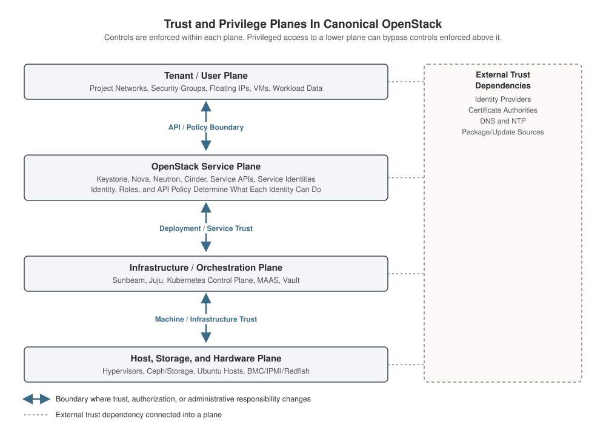

Security architecture and trust model
========================================

Canonical OpenStack is not a single security boundary. It is organized into a small number of conceptual security
planes, each with its own identities, administrative authority, and assumptions about trust. Understanding how those
planes relate is essential to understanding the platform's security posture.

This page explains how trust and privilege are distributed across those planes. It is not a general architecture page,
and it is not a procedural checklist. Instead it shows where controls are enforced, where trust is assumed, and where
privilege in one plane can bypass authorization enforced in another.

Conceptual security model
------------------------------------------------------------------------

The relationships in this page can be pictured as four conceptual security planes, from the user-facing edge to the
physical infrastructure underneath it. :doc:`/explanation/architecture` and :doc:`/explanation/design-considerations`
describe the underlying deployment topology in detail. This page is concerned with a narrower question, where trust and
privilege sit relative to each other.

Controls are enforced within each plane on its own terms, but privileged access to the infrastructure that implements
another plane can bypass the controls enforced within it. External trust dependencies connect into every plane rather
than only one of them. The diagram below shows this model.

      infrastructure/orchestration, and host/storage/hardware, connected by bidirectional boundaries, the API
      and policy boundary, deployment and service trust, and machine and infrastructure trust. Controls are
      enforced within each plane, and privileged access to the infrastructure that implements another plane
      can bypass the controls enforced within it. A dashed side panel for external trust dependencies, identity
      providers, certificate authorities, DNS and NTP, and package/update sources, connects into every plane.

   Trust and privilege planes in Canonical OpenStack.

These are a conceptual security model, not strict deployment boundaries, and some components sit in more than one plane
depending on how they're used. MAAS participates in the infrastructure and orchestration plane while relying on
hardware-management interfaces in the host and hardware plane to control machine lifecycle. Vault provides trust
services consumed by components in other planes. Storage systems can expose both service-level and infrastructure-level
interfaces. The sections below describe each plane, the boundaries between them, and the administrative privilege that
exists within and across them.

Security planes
------------------------------------------------------------------------

Tenant and user plane
~~~~~~~~~~~~~~~~~~~~~~~~~~~~~~~~~~~~~~~~~~~~~~~~~~~~~~~~~~~~~~~~~~~~~~~~

The tenant and user plane is where external users, automation, and tenant workloads interact with the cloud. It covers
projects, tenant networks, security groups, floating IPs, application credentials, and the virtual machines and
workloads running inside a project.

Tenant authority is constrained by the roles and scopes assigned through Keystone and by OpenStack service policy.
Access to OpenStack APIs is mediated by the configured identity and authorization mechanisms, and the specific scope a
given identity holds, one project, several projects, or a domain, depends on how those roles are assigned.

The isolation this plane relies on also depends on project separation holding at the network layer and on the hypervisor
and network services underneath it remaining uncompromised.

OpenStack service plane
~~~~~~~~~~~~~~~~~~~~~~~~~~~~~~~~~~~~~~~~~~~~~~~~~~~~~~~~~~~~~~~~~~~~~~~~

Keystone, Nova, Neutron, Cinder, and the other OpenStack APIs and service identities make up the OpenStack service
plane. OpenStack roles and service policy determine which API operations an identity, whether a cloud administrator or a
service account, can perform, and any change to resource policy, quotas, user assignments, or domain integrations stays
within the scope the API and its policy model expose.

The isolation this plane relies on also depends on the infrastructure it runs on, Kubernetes, Juju, the underlying
hosts, remaining unmodified beneath it. The next section covers how services within this plane trust each other.

Infrastructure and orchestration plane
~~~~~~~~~~~~~~~~~~~~~~~~~~~~~~~~~~~~~~~~~~~~~~~~~~~~~~~~~~~~~~~~~~~~~~~~

The infrastructure and orchestration plane is Sunbeam, Juju, and Kubernetes, the systems that deploy, configure, and
operate the OpenStack services, along with MAAS, which provisions machines for the deployment, and Vault where it's
enabled, acting as a secret manager and intermediary certificate authority.

Whoever holds the Juju controller and Kubernetes control-plane credentials can reach into charm settings, deployed
service configuration, and application relationships that no OpenStack role controls. The isolation this plane relies on
depends on those credentials staying secret from tenants and from OpenStack-level administrators, and on the hosts it's
deployed onto being trustworthy.

Host, storage, and hardware plane
~~~~~~~~~~~~~~~~~~~~~~~~~~~~~~~~~~~~~~~~~~~~~~~~~~~~~~~~~~~~~~~~~~~~~~~~

Ubuntu hosts, the KVM/QEMU/Libvirt hypervisor stack, Ceph and other storage systems, and the physical machines
underneath, including BMC, IPMI, or Redfish management interfaces, make up the host, storage, and hardware plane.

Host root access, storage administration, and hardware management all operate outside OpenStack's own authorization
model, and none of it is visible to or restricted by that model. This access can directly affect resources that
OpenStack manages, virtual machines, volumes, and tenant networks, without passing through any OpenStack API.

The isolation this plane relies on comes down to physical and out-of-band access being isolated, monitored, and limited
to a restricted set of personnel.

Trust within the OpenStack service plane
------------------------------------------------------------------------

OpenStack services do not operate as isolated silos within their own plane. They use service identities and credentials
to call one another, communicate through internal endpoints and message queues, and store control-plane state in service
databases.

Internal service communication can use TLS where configured. Certificate issuance and trust depend on the deployment's
certificate-management configuration.

This internal trust is separate from tenant trust. A tenant with a valid Keystone token authorizes each request through
the API, but a service acting as a client of another service authenticates using configured service credentials and
trust mechanisms, not tenant credentials. Network isolation can provide an additional layer of protection, but it
doesn't by itself establish a service's identity.

If a service identity, a database credential, or a certificate in this internal trust chain is compromised, the affected
service, or anything reachable through it, may accept forged or altered requests without that being visible at the
tenant-facing API.

Exactly which credential and certificate mechanisms apply, and how uniformly they're used, varies by service and by
deployment configuration. The Identity and access, and Cryptography, certificates, and secrets pages cover those
mechanics in more detail.

Trust between the planes
------------------------------------------------------------------------

A trust boundary is a point where authentication, authorization, or enforcement responsibility changes, where a
different administrative domain becomes responsible for what happens next. Four boundaries matter most between Canonical
OpenStack's planes.

User and API boundary
~~~~~~~~~~~~~~~~~~~~~~~~~~~~~~~~~~~~~~~~~~~~~~~~~~~~~~~~~~~~~~~~~~~~~~~~

Keystone mediates authentication and authorization at the OpenStack API boundary. Depending on the deployment, identity
may be provided locally or through configured external identity integrations, LDAP domains, or federation via OIDC or
SAML2.

Authorization itself runs through OpenStack project and role assignments and the policy they resolve to. TLS, where
configured, protects the API endpoint in transit, and the strength of this boundary also depends on where API endpoints
are reachable from.

This boundary governs cloud consumption. It doesn't say anything about what happens beneath the API.

Workload and host boundary
~~~~~~~~~~~~~~~~~~~~~~~~~~~~~~~~~~~~~~~~~~~~~~~~~~~~~~~~~~~~~~~~~~~~~~~~

Nova controls the lifecycle of a tenant workload, but once a virtual machine is running, its isolation from other
workloads and from the host itself depends on the hypervisor, not on any OpenStack API. Canonical OpenStack uses KVM,
QEMU, and Libvirt as the supported hypervisor stack.

In disaggregated and multi-node production topologies the compute role typically runs on dedicated nodes, separate from
control-plane and storage, though smaller or hyper-converged deployments can co-host the compute role with other
infrastructure roles on the same machine.

Host-level compromise can bypass OpenStack authorization outright, since the host touches the guest's runtime directly.
This is why host privilege operates outside OpenStack authorization rather than as part of it.

Service and infrastructure boundary
~~~~~~~~~~~~~~~~~~~~~~~~~~~~~~~~~~~~~~~~~~~~~~~~~~~~~~~~~~~~~~~~~~~~~~~~

Juju and Kubernetes deploy and manage the OpenStack services, including the application relations, charm configuration,
and service credentials those services are given at deploy time. That deployed configuration is a different privilege
domain from OpenStack resource and policy configuration.

An OpenStack cloud administrator controls resources through OpenStack APIs and policy, while a deployment administrator
controls the applications and infrastructure that implement those APIs. A deployment administrator can reconfigure
services, change charm relations, and influence application state in ways that don't map to any OpenStack role.

A compromised Juju controller or Kubernetes control plane can undermine the cloud's integrity even while the OpenStack
API layer keeps running normally. Vault can provide trust or secret-management services across these planes where it is
deployed, including issuing the certificates and secrets that Juju distributes to services. Exact per-service credential
and trust relationships vary by deployment and should be reviewed against the deployment manifest.

Infrastructure and hardware boundary
~~~~~~~~~~~~~~~~~~~~~~~~~~~~~~~~~~~~~~~~~~~~~~~~~~~~~~~~~~~~~~~~~~~~~~~~

MAAS provisions and manages the machines that Juju and Kubernetes are deployed onto, relying on hardware-management
interfaces, BMC, IPMI, or Redfish, to control machine power state, firmware, and operating-system deployment. Those same
interfaces can reach a host below the operating system entirely outside MAAS's provisioning relationship with it.

Storage administration is a separate infrastructure privilege. Access to Ceph and related storage infrastructure can
potentially reach tenant data outside typical OpenStack APIs, depending on the storage architecture and admin interfaces
in use.

None of this, machine lifecycle control or storage administration, is visible to the OpenStack authorization model. It
depends entirely on physical and out-of-band access being isolated, monitored, and limited to a restricted set of
personnel.

Administrative privilege
------------------------------------------------------------------------

Canonical OpenStack has several distinct administrative privilege domains, and they are not equivalent.

Tenant administration
~~~~~~~~~~~~~~~~~~~~~~~~~~~~~~~~~~~~~~~~~~~~~~~~~~~~~~~~~~~~~~~~~~~~~~~~

Tenant administration is typically scoped to one or more projects or domains through Keystone roles and policy, covering
things like allocating security groups, creating VMs, assigning floating IPs, and managing resources within that scope.
It grants no infrastructure-wide control of the platform.

OpenStack cloud administration
~~~~~~~~~~~~~~~~~~~~~~~~~~~~~~~~~~~~~~~~~~~~~~~~~~~~~~~~~~~~~~~~~~~~~~~~

Cloud administration operates at the OpenStack-level control plane. Administrative identities and roles can alter
resource policy, quotas, user assignments, and domain integrations through the supported APIs, a different privilege
domain from the deployed service configuration that Juju manages. This authority is powerful, but not necessarily the
highest administrative authority in the deployment.

Deployment and orchestration administration
~~~~~~~~~~~~~~~~~~~~~~~~~~~~~~~~~~~~~~~~~~~~~~~~~~~~~~~~~~~~~~~~~~~~~~~~

Deployment administration covers the Juju controller, Kubernetes control-plane administration, and Sunbeam operational
control. It changes how the cloud is built and managed, including charm settings, deployed service configuration, and
credentials, at a level ordinary OpenStack admin tasks don't reach. Because Juju and Kubernetes sit outside OpenStack's
authorization model entirely, that access doesn't appear as any OpenStack role.

Host administration
~~~~~~~~~~~~~~~~~~~~~~~~~~~~~~~~~~~~~~~~~~~~~~~~~~~~~~~~~~~~~~~~~~~~~~~~

Host administration is direct access to Ubuntu hosts and system-level control over the operating system. It operates
outside the OpenStack authorization model, so it can reach the execution environment of both OpenStack services and
tenant workloads, including resources normal OpenStack authorization doesn't cover.

Storage administration
~~~~~~~~~~~~~~~~~~~~~~~~~~~~~~~~~~~~~~~~~~~~~~~~~~~~~~~~~~~~~~~~~~~~~~~~

Storage administration is access to Ceph and related storage infrastructure. Because storage services operate outside
the application authorization layer, storage admins can potentially reach tenant data outside typical OpenStack APIs,
depending on the storage architecture and admin interfaces in use.

Hardware management
~~~~~~~~~~~~~~~~~~~~~~~~~~~~~~~~~~~~~~~~~~~~~~~~~~~~~~~~~~~~~~~~~~~~~~~~

Hardware management covers BMC, IPMI, Redfish, and related machine-control systems, which operate independently of the
operating system and can affect power state, firmware, remote console, and machine lifecycle. Hardware-management access
is therefore one of the most sensitive administrative capabilities in the deployment, and it doesn't require any
OpenStack admin involvement.

How sharply these domains are separated in practice depends on the deployment topology, and there is no universal
per-service credential matrix. Specifics should be reviewed against the deployment manifest.

External trust dependencies
------------------------------------------------------------------------

Canonical OpenStack also depends on trust relationships outside its own security planes.

Identity providers
~~~~~~~~~~~~~~~~~~~~~~~~~~~~~~~~~~~~~~~~~~~~~~~~~~~~~~~~~~~~~~~~~~~~~~~~

External IdPs are part of the trust model whenever Keystone is configured for LDAP or federation. Canonical OpenStack
supports OIDC and SAML2, along with the need to configure redirect URLs and certificates correctly. If the identity
provider is compromised or misconfigured, user authentication and authorization can be affected even when the OpenStack
service layer remains intact.

Certificate authorities
~~~~~~~~~~~~~~~~~~~~~~~~~~~~~~~~~~~~~~~~~~~~~~~~~~~~~~~~~~~~~~~~~~~~~~~~

Canonical OpenStack supports TLS using either an external CA or Vault as an intermediary CA, so trust in the certificate
chain matters. If a CA is compromised, or a certificate is misissued, it can affect the trust that clients and services
place in the cloud's endpoints.

DNS and NTP
~~~~~~~~~~~~~~~~~~~~~~~~~~~~~~~~~~~~~~~~~~~~~~~~~~~~~~~~~~~~~~~~~~~~~~~~

DNS and NTP dependencies affect service address resolution, time synchronization, and certificate validation. Incorrect
or maliciously manipulated DNS or time synchronization can undermine certificate validation, service discovery, logging,
and authentication behavior.

Package and update sources
~~~~~~~~~~~~~~~~~~~~~~~~~~~~~~~~~~~~~~~~~~~~~~~~~~~~~~~~~~~~~~~~~~~~~~~~

The platform relies on support and update channels for Ubuntu and the deployment stack, so the security model depends on
the integrity of package and update sources even when the OpenStack APIs themselves are healthy.

External storage and network systems
~~~~~~~~~~~~~~~~~~~~~~~~~~~~~~~~~~~~~~~~~~~~~~~~~~~~~~~~~~~~~~~~~~~~~~~~

The deployment may also depend on external storage systems, network routing, or upstream services. MAAS, networking, and
external connectivity are all part of production design, and compromise in these dependencies can affect the cloud's
security or availability even if OpenStack itself keeps functioning.

Separation of duties
------------------------------------------------------------------------

Separation of duties matters most when administrative authority is split across the security planes described above, and
across different human operators.

Canonical OpenStack exposes distinct administrative domains for cloud resources, deployment orchestration, hosts,
storage, and hardware management. Organizations can assign these responsibilities separately where their operating model
requires it, and doing so can reduce the impact of a compromised account and make administrative activity easier to
audit.

This principle matters most for the following.

* host administration versus project administration
* orchestration administration versus OpenStack administration
* MAAS management versus tenant use
* secret management versus service administration
* hardware management versus cloud operations

Canonical OpenStack doesn't prescribe or technically enforce a complete organizational separation model. This is an
operational practice the architecture makes possible by keeping administrative domains distinct, not a guarantee the
product provides on its own.

Designing a production trust model
------------------------------------------------------------------------

A sensible production trust model for Canonical OpenStack treats infrastructure administration as a distinct, tightly
restricted domain. The user-facing OpenStack API and the underlying host and deployment layers should not share the same
administrative reach without a clear, audited reason.

A strong production model has these characteristics.

* tightly restricted infrastructure administration
* separate human and service identities
* isolated management interfaces and management networks
* minimal administrative reachability across all control planes
* auditable privileged access with clear ownership of credentials
* explicit ownership of external trust dependencies such as IdPs, CA chains, DNS, NTP, and package sources

Related topics
------------------------------------------------------------------------

This page is intended to be read alongside the other security explanations in this documentation set.

.. TODO: link these as :doc: references once the target pages exist.

* :doc:`security-in-canonical-openstack`
* :doc:`identity-and-access`
* Network security
* Cryptography, certificates, and secrets
* Workload and data protection
* Host, operations, and infrastructure security
* Harden your Canonical OpenStack deployment
